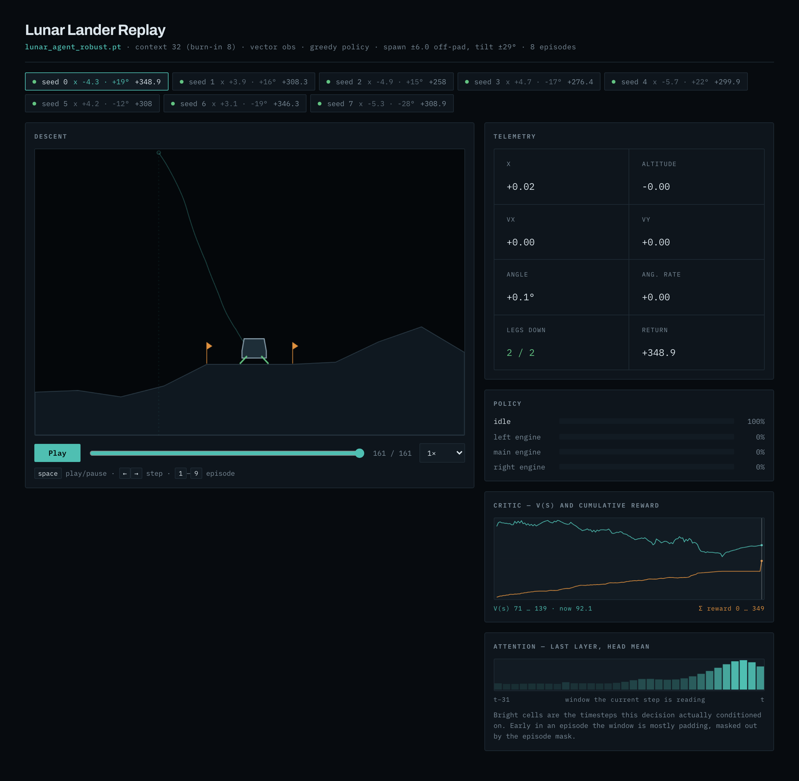

# lunar-rl

Causal-transformer + Impala-CNN PPO agent for `LunarLander-v3`, managed with `uv`.

Solves the environment — **+282.6** mean return, where 200 counts as solved — and
lands **8/8** from randomised off-pad, tilted starts. Ships a self-contained
replay page that shows the policy, the critic, and what the transformer's
attention window is actually reading.



Requires Python 3.11–3.12 (Box2D wheel availability). Trained weights for both
checkpoints are committed, so the viewer works straight after `uv sync`.

```bash
uv sync
uv run python -m lunar_rl.nets          # self-check (masking, two-hot, symlog)
uv run lunar-rl --total-steps 2500000    # reproduces the shipped lunar_agent.pt
uv run lunar-rl --pixels --num-envs 8    # pixel obs, transformer earns its keep
uv run lunar-rl-view --greedy --open     # record episodes -> self-contained replay page
```

---

## Read this first

LunarLander's 8-dim state (`x, y, vx, vy, θ, ω, leg1, leg2`) is **fully Markov**.
A 2-layer MLP with PPO solves it in about ten minutes. A transformer adds nothing
there, and a CNN has nothing to look at.

This repo exists for the case where that stops being true: `--pixels`, where the
observation is an 84×84 frame. A single frame shows position and attitude but not
velocity or angular rate. That is a genuine POMDP, and the K-step attention window
is what recovers the hidden state — replacing the frame-stacking hack with a
learned, variable-horizon memory. The vector path stays in the code as the honest
baseline you compare against.

| mode | observation | why the architecture |
|---|---|---|
| default | 8-dim state | baseline; transformer is dead weight, run it to confirm that |
| `--pixels` | 84×84 gray + state | frame is velocity-blind; attention supplies the missing state |

---

## Architecture

```
                    ┌─────────── one token per timestep ───────────┐
 state_t  (8)  ──── Linear ─────────────┐
 a_{t-1}  (∈0..4) ─ Embedding ──────────┤
 r_{t-1}  ───────── symlog → Linear ────┼──► + ──► LayerNorm ──► token_t (128)
 frame_t  (1×84×84) Impala CNN ─────────┘        (pixel term only with --pixels)

  token_{t-K+1} … token_t
        │
        ▼
  ┌──────────────────────────────────────────┐
  │ 3 × GTrXL block                          │
  │   pre-LN → RoPE multi-head attn → GRUGate│   mask = causal ∧ same-episode
  │   pre-LN → GELU MLP(4×)      → GRUGate   │
  └──────────────────────────────────────────┘
        │
        ▼  h_t  (128)
   ┌────┴────┐
 actor      critic
 4 logits   41 symlog bins → two-hot CE
```

### 1. Token construction

Each timestep becomes one token from **state + previous action + previous reward**
(+ frame in pixel mode). Feeding `(a_{t-1}, r_{t-1})` back in is standard for
sequence agents in POMDPs: without it the model cannot tell "I fired the main
engine and got −0.3" from "I did nothing and got −0.3", and reward is often the
only observable that disambiguates two visually identical states. Action index 4
is a reserved `NO_ACTION` embedding used at every episode start, so the model
never sees a fabricated previous action.

### 2. Impala CNN (`PixelEncoder`)

Three `[conv → maxpool → 2 residual blocks]` stages at 16/32/32 channels, then
`Flatten → ReLU → Linear → LayerNorm` to `d_model`. Espeholt et al.'s residual
trunk over the Nature-DQN stack: at comparable parameter count it holds up over
long runs where the plain stack's features drift. The trailing `LayerNorm` matters
— the pixel term is *added* to the vector term, so both must live on the same
scale or one silently dominates the token.

Frames are 84×84 grayscale, nearest-neighbour downsampled from Box2D's 400×600
render. No history is stacked into the channel dimension; that is the
transformer's job.

### 3. GTrXL causal transformer

Vanilla post-LN transformers diverge under PPO's non-stationary targets. Parisotto
et al.'s **GTrXL** fixes this with two changes, both implemented here:

- **Identity map reordering** — LayerNorm before the sublayer, so a fresh block's
  contribution starts as a clean residual path.
- **GRU gating instead of residual add** — `GRUGate(x, sublayer(x))` with update
  bias `+2.0`. The update gate starts near zero, so each block begins as the
  identity and has to earn its contribution. This is the single change that makes
  the difference between converging and not.

**RoPE, not learned positions.** Rotary embeddings encode *relative* offset. That
is load-bearing here: while acting, the model sees a sliding window ending at
`t`; while training, it sees a fixed chunk. Absolute positions would make the same
transition look different in the two regimes. Relative geometry makes them
identical.

**Episode masking.** The attention mask is `causal ∧ same-episode`, built by
cumsum over per-step episode-start flags:

```python
seg  = starts.long().cumsum(1)
mask = (seg[:, :, None] == seg[:, None, :]) & tril(ones(T, T))
```

Without the same-episode term, a chunk straddling a reset lets the agent condition
a fresh landing on the previous episode's crash. With it, a rollout can be cut at
arbitrary points — which is what makes the flat chunked buffer below legal.
`nets._demo()` asserts this behaviourally: perturbing the first half of a chunk
leaves the second half's logits bit-identical.

### 4. Two-hot symlog critic

From DreamerV3. Instead of MSE on the return, the head predicts a distribution over
41 bins spanning `[-20, 20]` in symlog space, trained with cross-entropy against a
two-hot target; the value is the symexp of the bin expectation.

MSE value regression makes the loss scale environment-dependent, so `vf_coef` has
to be retuned whenever the reward magnitude moves. LunarLander's returns span
roughly −400 to +300, and shaped pixel variants shift that again. The binned head
is scale-free and gives no gradient advantage to outlier returns. Logits are
zero-initialised, so `V = 0` exactly at step 0 — no early bootstrap blow-up.

### 5. PPO with chunked BPTT and burn-in

Rollout is `(T=128, N=16)`. For the update it is cut into contiguous `chunk=24`
windows, each prefixed with `burn_in=8` earlier steps:

```
rollout:  |························ T = 128 ························|
window 0:        [burn 8][         chunk 24         ]
window 1:                       [burn 8][      chunk 24      ]
loss:              masked   ←→   trained
```

A transformer trained on naive fixed chunks sees an empty context at every chunk
head, while the actor that generated those actions had a full window. That
mismatch biases the ratio in the PPO objective. R2D2's burn-in fixes it: the
prefix fills attention context, its loss is masked to zero, and gradients only
touch positions whose context matches what the actor actually saw.

One forward pass per window produces logits and values for **all 32 positions** at
once — the reason chunked attention beats step-by-step recurrence in wall-clock.
Acting still re-runs the K-step window each step (`History.push` rolls the buffer);
at `K=32` and `d=128` that is cheaper than the Box2D step itself.

Everything else is textbook PPO: GAE(λ=0.95), clip 0.2, 4 epochs × 4 minibatches,
entropy 0.01, grad-norm clip 0.5, linear LR anneal.

---

## Replay viewer

```bash
uv run lunar-rl-view --ckpt lunar_agent.pt --episodes 5 --greedy --open
```

Rolls out the trained policy, records every step, and writes a **single
self-contained `lunar_replay.html`** — trajectories inlined, no server, no build
step, no CORS. Opens over `file://` and survives being emailed.

Panels:

| panel | shows |
|---|---|
| Descent | terrain, helipad flags, lander pose, live thruster flames, trail |
| Telemetry | the 8 state dimensions plus running return |
| Policy | full action distribution per step, sampled action highlighted |
| Critic | `V(s)` against cumulative reward, with a playhead |
| Attention | last-layer head-mean attention of the current step over its K-window |

The attention strip is the panel worth having: it is the only direct read on
whether the sequence model is using its memory or ignoring it. Early in an
episode most of the window is padding and the episode mask zeroes it; if the
strip stays pinned to `t` for a whole episode, the transformer is not earning
its parameters and you should be running the MLP baseline.

### Spawn randomisation

Vanilla `LunarLander` spawns the craft **dead centre above the helipad at angle
0** every single time. The only per-seed randomness is a small force impulse, so
no choice of seed puts the lander off-pad or tilted — the terrain changes, the
approach does not.

`StartPose` fixes that. It rigidly transforms the lander and both legs after
reset — rigid so the revolute joints stay satisfied — and re-derives the
observation the same way the env does, since `LunarLander.reset` itself ends with
an idle `step(0)`. The pose is drawn from the env's own RNG, so seed N now means
a genuinely different approach:

```bash
uv run lunar-rl-view --start-x 6 --start-tilt 0.5     # defaults: ±6 units, ±29°
uv run lunar-rl      --start-x 6 --start-tilt 0.5     # same knob for training
```

Magnitudes are floored at 40% of the range. A plain uniform draw would sometimes
put the lander back over the pad (half-width 2.0 world units) at a tilt too small
to see, which defeats the point. Every seed now starts clear of the pad, tilted
12–29°, on alternating sides.

The page surfaces the pose: each episode tab reads `x +4.4 · −17°`, and the
canvas marks the spawn point with a ring and a dashed drop line so an off-pad
start is legible against a centred pad.

**Randomised starts need randomised training.** The centre-trained checkpoint
generalises most of the way but not all of it — on eight off-pad seeds it lands
6/8, and both failures are far-left starts it never saw. Training with the same
flags fixes it:

```bash
uv run lunar-rl --start-x 6 --start-tilt 0.5 --device cuda \
                --total-steps 3500000 --save lunar_agent_robust.pt
```

| checkpoint | trained on | 8 off-pad seeds | mean return |
|---|---|---:|---:|
| `lunar_agent.pt` | centred starts | 6 / 8 land | +193.7 |
| `lunar_agent_robust.pt` | ±6 units, ±29° | **8 / 8 land** | **+313.1** |

The two seeds the centred policy crashed (`x −4.86` and `x −5.74`) recover to
+276.1 and +309.2. 3.5 M steps, 29 min on one CUDA card — with eight runs sharing
the box, so treat that as an upper bound rather than a clean single-run time.

**Why not a Rust backend.** The page replays a recorded trajectory — zero
inference at view time. A server would only be re-serving constants. Rust earns
its place here only if you want *live* inference driven from the browser at 50
Hz for many concurrent viewers; then an `axum` server around `candle` or `tract`
holding the weights is the right shape, and the page swaps its replay array for
a WebSocket. Nothing in this repo needs that.

Getting the attention out costs something: `F.scaled_dot_product_attention`
never materialises the probability matrix. `Agent.forward(..., want_attn=True)`
recomputes attention the explicit way and returns it. The self-check asserts the
two paths agree to `1e-4`, so the viewer cannot silently show weights from a
different computation than the one that picked the action.

---

## Research lineage

| piece | source | what it buys |
|---|---|---|
| PPO | Schulman et al. 2017 | on-policy backbone that tolerates a big model |
| Impala CNN | Espeholt et al. 2018 | pixel encoder that survives long runs |
| GTrXL | Parisotto et al. 2020 | transformers that don't diverge in online RL |
| R2D2 burn-in | Kapturowski et al. 2019 | correct context for chunked sequence training |
| RoPE | Su et al. 2021 | acting window ≡ training chunk |
| Two-hot symlog | Hafner et al. 2023 (DreamerV3) | scale-free critic, no `vf_coef` retuning |

**Deliberately not here.** *Decision Transformer / Trajectory Transformer* are
offline, return-conditioned sequence models — a different problem statement; this
is online PPO. *Mamba/S4* would swap O(K²) attention for a linear-time scan, which
buys nothing at `K=32`. *DreamerV3's world model* would beat this on sample
efficiency and is the right next step if wall-clock per environment step is the
constraint, but it is a much larger build.

---

## Layout

```
pyproject.toml          uv project; box2d-py gets swig via extra-build-dependencies
src/lunar_rl/nets.py    encoders, GTrXL blocks, masking, critic + self-check
src/lunar_rl/ppo.py     env wrappers, rollout, GAE, chunked update, CLI
src/lunar_rl/viewer.py  rollout recorder; inlines trajectories into the page
src/lunar_rl/replay.html  the SPA template (one __REPLAY_DATA__ placeholder)
```

Two checkpoints ship: `lunar_agent.pt` (centred starts, +282.6) and
`lunar_agent_robust.pt` (randomised starts, +313.1 on the harder distribution).

Two source files. Flags come from the `Config` dataclass — every field is a
`--kebab-case` CLI arg automatically.

## Measured

Vector mode, 16 envs, Apple M4 CPU, single seed, 2.5 M steps (~28 min):

| env steps | mean return (last 50 eps) |
|---:|---:|
| 205 k | +39.4 |
| 410 k | +83.6 |
| 819 k | +139.2 |
| 1.02 M | +228.5 |
| 1.43 M | +270.7 |
| 2.05 M | +273.7 |
| 2.50 M | **+282.6** |

LunarLander counts as solved at 200. Greedy evaluation of the saved checkpoint
lands 6/6 episodes, mean return **+270.9**, ~175 steps per episode — decisive
descents, not the hovering that an under-trained policy settles into.

| run | throughput (M4 CPU) |
|---|---|
| vector, 16 envs | ~1200 steps/s |
| pixels, 4 envs | ~17 steps/s |

Pixel mode is **render-bound**, not compute-bound: Box2D's `rgb_array` render
dominates. Raise `--num-envs` first (the `AsyncVectorEnv` parallelises rendering
across processes); move to CUDA only after that stops helping.

### Seed variance

The single-seed caveat is measurable, so here it is measured. Four runs of each
recipe, identical except `--seed`, trained concurrently across the two GPUs and
evaluated greedily on **20 held-out seeds (100-119)** that neither training nor
any published table above touches. The last column is the 0.1.0 checkpoint, same
recipe, trained on Apple silicon:

| recipe | seed 1 | seed 2 | seed 3 | seed 4 | 0.1.0 weights |
|---|---:|---:|---:|---:|---:|
| centred, centred starts | 286.2 | 283.5 | 269.1 | 285.0 | **289.7** |
| robust, off-pad starts | **330.4** | 324.9 | 322.7 | 328.4 | 320.9 |

Two things fall out, and they point opposite ways. `lunar_agent.pt` is already
the best centred policy on this evidence — rerunning does **not** improve it, and
seed 3 lands only 17/20 — so a single reported number overstates its precision by
roughly the 17-point spread of its own recipe. On the robust recipe every run
beat the 0.1.0 weights, the best by +9.5.

**Read the seed-1 column carefully.** Both 0.1.0 checkpoints were themselves
trained at the default `--seed 1`, so that column is not a different seed at all
— it is the *same* seed on different hardware. Box2D, MPS and CUDA disagree in
the last bits, the trajectories diverge, and 3.5 M steps later the two runs sit
9.5 points apart on held-out seeds. Columns 2-4 are the genuine seed re-rolls;
column 1 measures how much of the "seed variance" here is really backend
nondeterminism. On this evidence the two effects are the same size, which is the
more uncomfortable half of the result — a reported return is only reproducible on
the hardware that produced it, which is precisely why the weights are committed
rather than a training command.

**0.1.1 ships the seed-1 run.** Re-scored on 50 further unseen seeds (200-249) it
holds a smaller but real edge over the 0.1.0 robust weights: mean +15.1
(bootstrap 95% CI [+4.8, +32.8]), median +6.9, better on 33/50 seeds (sign test
p = 0.033). A paired t-interval spans zero ([−0.95, +31.05]), because a single
0.1.0 episode crashes to −66.2 and drags the mean; the sign test and the
bootstrap are the ones to trust here. The reliability gap is the clearer half:
50/50 landings against 49/50, return std 16.4 against 55.9, worst case +286.9
against −66.2, and 204 steps per episode against 238.

---

## GPU acceleration

Measured on this repo, not asserted. Identical 40 960-step run, Apple M4,
varying only `--device` and `--num-envs`:

| device | envs | steps/s | vs baseline |
|---|---:|---:|---:|
| cpu | 16 | 1 509 | 1.0× |
| mps | 16 | 2 791 | 1.8× |
| cpu | 128 | 4 761 | 3.2× |
| mps | 128 | 10 735 | **7.1×** |

```bash
uv run lunar-rl --total-steps 40960 --num-envs 128 --device mps   # reproduce any row
```

The 2.5 M-step run that produced `lunar_agent.pt` took ~28 min at the top-left
cell. The bottom-right cell does the same work in about four.

### Why both levers pay

Model-only timings, same M4 (`--device auto` already picks the accelerator):

| batch | update step, cpu | update step, mps | rollout forward, cpu | rollout forward, mps |
|---:|---:|---:|---:|---:|
| 16 | 22.96 ms | 10.05 ms | 6.28 ms | 2.52 ms |
| 256 | 71.00 ms | 19.14 ms | 23.08 ms | 6.36 ms |
| 1024 | 229.68 ms | 67.00 ms | 86.37 ms | 42.79 ms |

The accelerator wins even at batch 16, which is not what a 1.2 M-parameter model
would normally do. The reason is that this model is **op-dispatch-bound, not
FLOP-bound** on CPU: each GTrXL gate is six small `Linear`s, so three gated
blocks add ~36 extra tiny matmuls per forward. Python-side dispatch dominates,
and moving the same graph to a device with cheaper per-op cost wins regardless
of arithmetic intensity.

Widening `--num-envs` is still the larger lever (3.2× on CPU alone), because it
amortises that dispatch cost across more environments per call **and** keeps the
device busy. The two multiply.

> These numbers are Apple MPS. On CUDA the absolute figures differ and
> launch-overhead behaviour at tiny batch is its own story — but the ordering of
> the levers below holds, and every row above is reproducible with one command.

### On CUDA — 2 × RTX PRO 6000 Blackwell

Same protocol on a Linux box with two Blackwell cards (94 GiB each, sm_120), 48
CPU cores, torch 2.13.0+cu130. Each row is **20 PPO iterations**
(`total_steps = 20 × 128 × envs`), so every config is measured at steady state
instead of being dominated by startup:

| device | envs | steps/s | vs cpu-16 |
|---|---:|---:|---:|
| cpu | 16 | 1 867 | 1.0× |
| cuda | 16 | 2 729 | 1.5× |
| cpu | 128 | 7 196 | 3.9× |
| cuda | 128 | 13 677 | 7.3× |
| cpu | 512 | 10 337 | 5.5× |
| cuda | 512 | 24 857 | 13.3× |
| cuda | 1024 | 27 478 | 14.7× |
| cuda | 2048 | 27 627 | **14.8×** |
| cuda | 4096 | 26 823 | 14.4× |

```bash
uv run lunar-rl --total-steps 1310720 --num-envs 512  --device cuda  # the 512 row
uv run lunar-rl --total-steps 5242880 --num-envs 2048 --device cuda  # the fastest row
```

The MPS ordering holds — the accelerator wins at every width, and `--num-envs` is
the larger lever — but **the environment ceiling arrives early and then bites
back**. Widening 16→128 buys 5.0×, 128→512 buys 1.8×, 512→1024 buys 1.1×,
1024→2048 buys nothing (1.005×), and 2048→4096 is a *regression* to 0.97×.
Throughput peaks at **2048 envs**; past that the per-step Python work over a wider
batch costs more than the extra parallelism returns. Vector mode uses
`SyncVectorEnv`, which steps Box2D serially in one Python process, so past roughly
512 envs you are timing the physics rather than the policy. This is the same wall
the ladder below describes, hit from the other side: on this hardware, tuning the
model is not worth doing until the environment leaves the CPU.

The turnover is not run-to-run noise. The 512 and 1024 rows were measured twice,
hours apart — 24 915 / 27 568 the first time against 24 857 / 27 478 here — and
agree to within 0.3%.

#### The GPU is idle, not small

Sampling `nvidia-smi` once a second through each run, averaged over the
steady-state half of the window:

| envs | steps/s | mean util | peak util | VRAM |
|---:|---:|---:|---:|---:|
| 512 | 24 857 | 17% | 84% | 2.2 GiB |
| 1024 | 27 478 | 14% | 92% | 3.6 GiB |
| 2048 | 27 627 | 18% | 97% | 6.3 GiB |
| 4096 | 26 823 | 21% | 99% | 11.9 GiB |

The mean and the peak together are the whole argument. During the update phase the
card briefly reaches 84-99%, so the kernels are not the problem — the mean sits at
14-21% because the card spends the rest of every iteration *waiting* on Box2D
stepping in one Python process. Widening the batch raises the peak and barely
moves the mean.

VRAM is a non-issue at this scale: 4096 envs occupy 11.9 GiB of a 94 GiB card, so
memory would permit roughly 8× more parallelism than the CPU can actually feed.
Nothing about this workload justifies a card this size.

#### `--pixels` on CUDA needs the bundled cuDNN

On a host with CUDA already installed system-wide, `--pixels --device cuda` used
to abort in native code before the first log line:

```
Invalid handle. Cannot load symbol cublasLtGetVersion
```

The cause is a soname collision, not a fault in the model. A system cuDNN 9.20
built against CUDA 12 sits on `LD_LIBRARY_PATH` and exports the same
`libcudnn_*.so.9` sonames as the cu13 wheel torch depends on, so the loader hands
the convolution engines the system copy — which then dlopens `libcublasLt.so.12`,
absent on a CUDA 13 box, and the process aborts. Only `--pixels` trips it: the
vector path never runs a convolution, which is why every table above was
unaffected and why the failure looks like a pixel-mode bug rather than an
environment one.

`pin_bundled_cudnn` (`ppo.py`) dlopens the wheel's own cuDNN by absolute path
before the first conv, so the later resolve-by-soname finds it already loaded.
No environment variables, and a silent no-op wherever cuDNN is not bundled.

#### `--compile` only pays on long runs

`torch.compile` warmup lands **inside** the timed region, so short runs report it
as a regression and long ones as a win. Same 512-env config, two horizons:

| config | 1.31 M steps (20 it) | 3.28 M steps (50 it) |
|---|---:|---:|
| eager | 24 915 | 23 347 |
| `--compile` | 19 923 (↓20%) | **25 487** (↑9%) |
| `--amp` | — | 22 420 (↓4%) |
| `--compile --amp` | 18 147 (↓27%) | **25 667** (↑10%) |

Warmup costs ~24 s and the crossover falls between 1.3 M and 3.3 M steps, so
`--compile` belongs on real training runs and not on smoke tests or short sweeps.
`--amp` is neutral-to-negative here: at `d_model = 128` there is too little
arithmetic per kernel for bf16 to recover its cast overhead.

#### What the second GPU is for

At 1.2 M parameters with a CPU-bound environment, a second card does nothing for
a single run — there is no tensor worth sharding and the first card already idles
through roughly four fifths of every iteration (table above). It buys **concurrency across runs**. Since each `SyncVectorEnv` process
pins about one core, eight concurrent 16-env trainings fit comfortably on 48
cores and two cards, holding both at 97-99% utilisation for ~16 000 steps/s
aggregate — roughly 6 × the single-run 16-env rate. That is what turns the
single-seed caveat below from a standing limitation into a 30-minute experiment.

### The rest of the ladder

**1 · More envs, first.** `--num-envs 512`+. Two ceilings appear as you scale:
`AsyncVectorEnv` spawns **one process per env**, so past roughly `2 × cores` you
buy scheduler overhead, not throughput; and Box2D still steps on the CPU, which
becomes the hard floor.

**2 · Get the environment out of Python.**
[EnvPool](https://envpool.readthedocs.io/en/latest/env/box2d.html) implements
`LunarLander` in C++ with an internal thread pool and a batched API — the biggest
win available without rewriting physics. Wheels are Linux/x86-64; on Apple
silicon you build from source.

**There is no off-the-shelf GPU LunarLander.** `gymnax`'s registry covers classic
control, MinAtar, bsuite and misc tasks — LunarLander is not among them (checked
against `gymnax/registration.py`, not assumed). Brax and pgx solve different
environments. Writing one is tractable: rigid body, three thrusters, terrain
contact, 4096 envs resident on device. Box2D's contact solver is the only
genuinely hard part and a simplified contact model suffices here. Real work, not
a flag.

**3 · Compiler and precision.**

```bash
uv run lunar-rl --num-envs 512 --device cuda --compile --amp
```

- `--compile` wraps the agent in `torch.compile`. Verified numerically identical
  to the eager path (same per-iteration returns). At this model size the win is
  dispatch elimination, so `mode="reduce-overhead"` (CUDA graphs) is the next
  variant to try — it targets exactly the bottleneck the table above exposes.
- `--amp` runs bf16 autocast on CUDA. Logits and the critic hidden are cast back
  to fp32 before the distribution and the two-hot loss, so no `GradScaler` is
  needed and the value bins stay numerically sane.
- TF32 is enabled automatically on CUDA.

**4 · Attention kernel.** SDPA receives a **bool** `attn_mask`, which rules out
the FlashAttention backend and falls through to the memory-efficient kernel. At
K = 32 this is irrelevant. Past a few hundred, express `causal ∧ same-episode` as
a `flex_attention` `mask_mod` — it compiles the rule into the kernel instead of
materialising a `(B, T, T)` tensor.

**5 · When the env is immovable.** An **IMPALA / SEED-RL split**: actors across
CPU cores, one batched-inference learner on the GPU, V-trace to correct the
off-policy lag. A different training loop, not a tuning change.

### Pixel mode is a different problem

At 17 steps/s on the M4, `--pixels` is bound by Box2D's software `rgb_array`
render, not by the CNN. No device flag touches that. Raise `--num-envs` first; if
that is not enough, rasterise the observation from the state vector on the GPU
rather than asking the env to render it.

Measured on CUDA — 20 PPO iterations per row, `AsyncVectorEnv` over 48 cores:

| envs | steps/s | mean util | peak util | VRAM |
|---:|---:|---:|---:|---:|
| 4 | 340 | 21% | 50% | 1.5 GiB |
| 32 | 1 282 | 59% | 92% | 5.9 GiB |
| 64 | **1 335** | 64% | 96% | 10.3 GiB |

The advice holds: widening 4→32 envs buys 3.8×, 32→64 buys 4%, so the render
saturates at roughly 32 worker processes and further parallelism is wasted. At
matched width the card is worth about 20× the M4 (340 against ~17 steps/s).

The utilisation column is the surprise. Pixel mode is the **only** configuration
in this repo that genuinely loads the GPU — 59-64% mean against 14-21% for vector
mode — because the Impala CNN is real arithmetic rather than a handful of tiny
matmuls waiting on Box2D. Vector mode is the faster way to train this agent; pixel
mode is the only one where the hardware is the thing being used.

---

## Reproducibility

Both checkpoints are committed here, so every number in this README can be
checked without retraining anything:

```bash
uv run lunar-rl-view --ckpt lunar_agent_robust.pt --episodes 8 --greedy --seed 0
```

| checkpoint | sha256 | produced by |
|---|---|---|
| `lunar_agent.pt` | `06bed623…958faec7` | `uv run lunar-rl --total-steps 2500000 --num-envs 16 --device cpu` |
| `lunar_agent_robust.pt` | `122ab5fc…1f2fe2` | `uv run lunar-rl --total-steps 3500000 --num-envs 16 --device cuda --seed 1 --start-x 6 --start-tilt 0.5` |

The robust weights changed in 0.1.1. The
[v0.1.0 release](https://github.com/mraad/lunar-rl/releases/tag/v0.1.0) still
carries the previous pair; `lunar_agent.pt` is identical there, but its
`lunar_agent_robust.pt` is the 320.9 run the seed table above compares against.

```
$ shasum -a 256 lunar_agent.pt lunar_agent_robust.pt
06bed623de41bee8283b7168533796b6a373f0ec57fb13f87694db31958faec7  lunar_agent.pt
122ab5fcbdacf4936b7da5ab9b11c5b25145bb3775557fa3627f3eeafa1f2fe2  lunar_agent_robust.pt
```

`lunar_agent.pt`, the M4 throughput tables and the spawn study were produced on:

| | |
|---|---|
| platform | macOS, Apple M4 Max (arm64) |
| python | 3.12.12 |
| torch | 2.13.0 |
| gymnasium | 1.3.0 |
| numpy | 2.5.2 |

`lunar_agent_robust.pt`, the CUDA tables and the seed sweep were produced on:

| | |
|---|---|
| platform | Linux 6.17 (x86-64), 48 cores |
| gpu | 2 × NVIDIA RTX PRO 6000 Blackwell Server Edition, 94 GiB, sm_120 |
| driver | 595.58.03 (CUDA 13.2 runtime) |
| python | 3.12.13 |
| torch | 2.13.0+cu130 (CUDA 13.0) |
| gymnasium | 1.3.0 |
| numpy | 2.5.2 |

Both shipped checkpoints were re-verified there against their committed
checksums and reproduce their published evaluation numbers exactly.

`uv.lock` pins the full dependency graph, and seeds are fixed (`--seed`, default
1). **Retraining will not reproduce these weights bit-for-bit** — Box2D, MPS and
CUDA kernels are not deterministic across backends or hardware, and PyTorch makes
no cross-device bitwise guarantee. Expect the same learning curve shape and final
performance band, not identical numbers. The checkpoints are shipped precisely so
that evaluation results *are* exactly reproducible.

## Known ceilings

- Truncation is treated as termination in the GAE recursion. LunarLander truncates
  only at 1000 steps, long after any competent policy has landed. Bootstrapping
  from `final_obs` needs that state's attention context, which the flat buffer does
  not carry — real work for a negligible bias here.
- Acting re-runs the full K-step window per step instead of keeping a KV cache.
  Free to fix if `K` grows past ~64.
- Nearest-neighbour frame downsampling, to avoid an OpenCV dependency.
- Single seed per shipped checkpoint. RL variance across seeds is large — see
  [Seed variance](#seed-variance) for the four-seed spread on both recipes; the
  curve above is evidence the loop works, not a benchmark.
- `StartPose` teleports the lander rather than changing how the env constructs
  it. Cheaper than subclassing `LunarLander`, and it reuses the env's own
  observation derivation — but it does depend on `lander`/`legs` staying public
  on the unwrapped env.

---

## License

[Apache-2.0](LICENSE). Copyright 2026 mraad.
